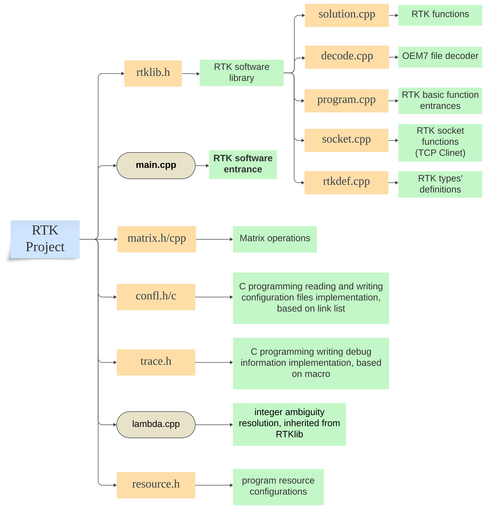
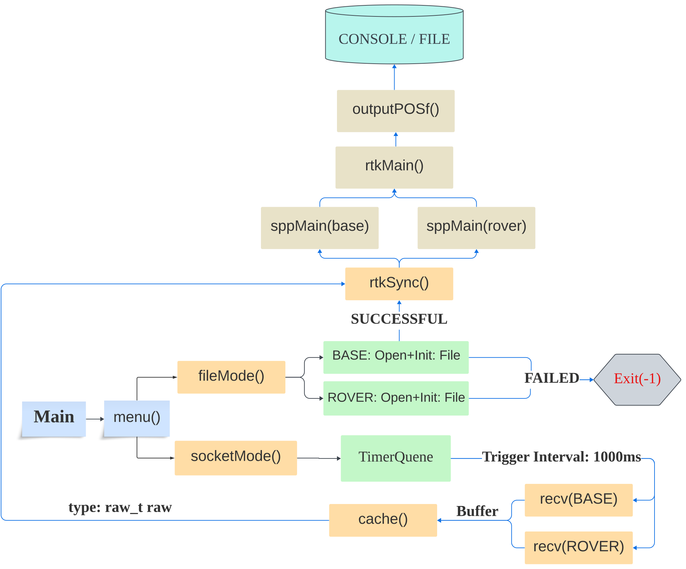

# RTK

The RTK software supports dual-frequency, dual-system GPS (L1, L2) and BDS (BeiDou Navigation Satellite System) (B1I, B3I) signals for raw binary data in NovAtel OEM7 format.

Contact me: lewis5499@whu.edu.cn

## 1 RTK Project Configuration Parameters

The project's configuration file is rtkcfg.config in the ./config directory, providing different resolution parameters:

·Single-frequency + dual-frequency/Dual-frequency RTK

·Real-time/Post-processing RTK

·Static/Dynamic RTK

·Least squares/Extended Kalman filter

·Output debug information: yes/no

·Custom raw file/result output path

·'rtkplot' standard format for solution results

·Local synchronous storage of TCP client data

·Custom process/measurement noise, ratio threshold, satellite elevation angle cutoff, etc.

## 2 Program Compilation and Execution

### 2.1 Source Code and Compilation

Managed with VS 2017, all source code is available in the ./src directory.

If you wish to run the RTK.exe program separately outside the project, consider modifying the configuration file reading location and recompiling the project. It is recommended to modify PATH_CFGDIR and PATH_LOGDIR in rtklib.h to ensure the configuration file is appropriately read and result files can be found (e.g., change '..\\' to '.\\').

### 2.2 Dependencies

Besides the basic C++ standard library, the RTK project has no other dependencies.

### 2.3 Execution Results

RTK positioning results (.pos/.cmp files), intermediate results (.log files), debug traces (.trace files), etc., are saved in the ./log folder.
If not for secondary development, it's advised not to enable outputting debug information in the configuration file, as frequent IO will significantly reduce execution efficiency. Alternatively, if you prefer, you can choose to disable the compilation of log/trace-related modules in trace.h and recompile the project, which will reduce the size of the generated exe file.

### 2.4 Visualization

The '*.cmp' files in the ./log folder (compressed pos result files) are compatible with rtklib standards, allowing direct import into rtkplot.exe for RTK result visualization.

## 3 Datasets

### 3.1 Test Data

Your NovAtel OEM7 raw binary files are stored in the ./dataset directory; ensure differentiation between base station and rover data.

### 3.2 RTK Self-collected Data

If solving in real-time RTK mode, the program defaults to capturing raw binary data broadcasted from base and rover stations via TCP client, saving them as "*.oem719" in the ./log directory.

## 4 Module Inheritance

Independent inheritable modules are provided: confl.h/c (configuration file read/write based on singly linked lists), matrix.h/cpp (rich matrix operations), trace.h (debugging and logging) can be used as standalone modules for relevant development references.